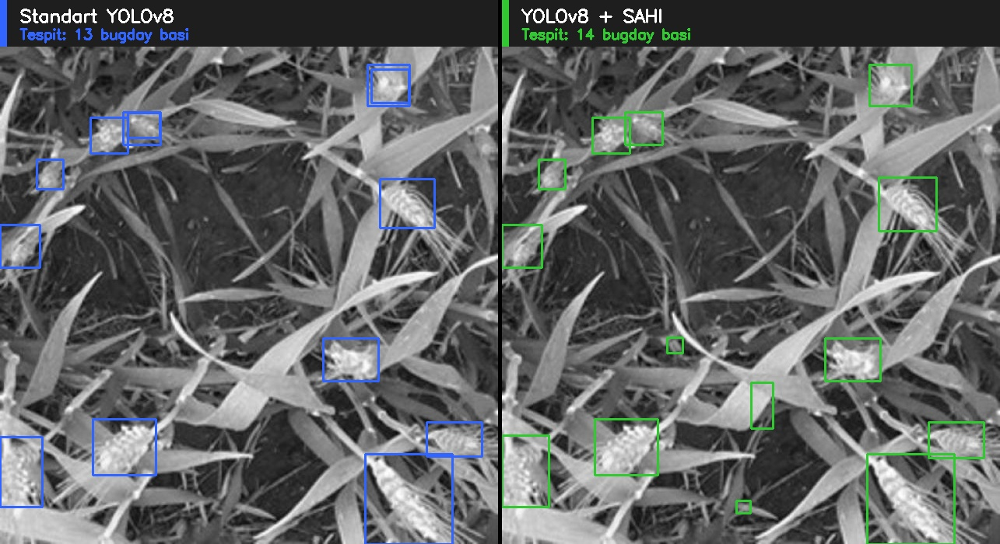

# 🌾 Wheat Head Detection with YOLOv8 + SAHI

Buğday başı sayımı için bilgisayar görüsü prototipi.



> Sol panel: Standart YOLOv8 (13 tespit). Sağ panel: YOLOv8 + SAHI sliced inference (14 tespit). Aynı test görseli üzerinde iki yaklaşımın gösterilmesi.

---

## 📋 Proje Hakkında

Bu proje, **buğday başı sayımı** için tasarlanmış uçtan uca bir bilgisayar görüsü prototipidir. Modern hassas tarım uygulamalarında, drone'dan elde edilen havadan görüntüler üzerinde otomatik mahsul sayımı, **verim tahmini** ve **hasat planlaması** için kritik bir bileşendir.

Çalışmada üç ana ürün üretildi:

1. **YOLOv8n fine-tuned model** — Transfer learning ile buğday başı tespitine özel
2. **SAHI entegrasyonu** — Küçük nesne tespitinde performansı sınamak için sliced inference
3. **Rigorous evaluation framework** — İki yaklaşımın sayım hatası ve hız bakımından karşılaştırması

**Bağlam:**Bu prototip, lokal drone üreticileri için **hassas tarım yazılım katmanının** nasıl inşa edilebileceğine dair somut bir örnek olarak hazırlanmıştır.

---

## ⚙️ Teknoloji Yığını

| Bileşen | Sürüm / Detay |
|---|---|
| Python | 3.11 |
| PyTorch | 2.6.0 + CUDA 12.4 |
| Ultralytics YOLOv8 | 8.4.67 |
| SAHI | 0.11+ |
| OpenCV | 4.10+ |
| Donanım | NVIDIA GeForce RTX 3050 Ti Laptop GPU (4 GB VRAM) |
| OS | WSL2 Ubuntu |

---

## 📊 Veri Seti

- **İsim:** Kaggle Wheat-Head Detection
- **Kaynak:** [Roboflow Universe](https://universe.roboflow.com/kaggle-lfmsn/wheat-head-nwevg)
- **Orijin:** Global Wheat Head Detection 2020 (Kaggle Competition)
- **Toplam görsel:** 14,721 (train: 12,006 | val: 1,355 | test: 1,360)
- **Sınıf:** 1 (`wheat`)
- **Lisans:** CC BY 4.0
- **Akademik atıf:** David, E. et al. (2021)

---

## 🔬 Yöntem

### Eğitim Konfigürasyonu

```bash
yolo train \
  model=yolov8n.pt \
  data=Wheat-Head-1/data.yaml \
  epochs=30 \
  batch=16 \
  imgsz=640 \
  fraction=0.15 \
  workers=2 \
  cache=False
```

**Anahtar tercihler:**

- **Transfer learning** YOLOv8n COCO pretrained ağırlıklarından (319/355 katman transfer edildi)
- **`fraction=0.15`** — train set'in %15'i kullanıldı (~1,801 görsel) — 4 GB VRAM kısıtında hızlı iterasyon için
- **AMP** (Automatic Mixed Precision) — `batch=16`'yı 4 GB VRAM'e sığdırabilmek için kritik
- **AdamW** optimizer otomatik seçildi (lr=0.002, momentum=0.9)
- **Eğitim süresi:** ~49 dakika

### SAHI Konfigürasyonu

```python
get_sliced_prediction(
    image_path,
    sahi_model,
    slice_height=320,
    slice_width=320,
    overlap_height_ratio=0.2,
    overlap_width_ratio=0.2,
)
```

---

## 📈 Sonuçlar

### Eğitim Metrikleri (best.pt, Epoch 30)

| Metrik | Değer |
|---|---|
| **mAP@50** | **0.842** |
| **mAP@50-95** | 0.437 |
| Precision | 0.877 |
| Recall | 0.763 |
| Inference hızı | 5.3 ms/görüntü (~190 FPS) |

### Standart YOLOv8 vs YOLOv8 + SAHI (50 test görseli)

| Metrik | Standart YOLOv8 | YOLOv8 + SAHI |
|---|---|---|
| Toplam tespit | 2,124 | 2,215 |
| Sapma (gerçek: 2,135) | **-0.5%** | +3.7% |
| Görüntü başına ortalama | 42.5 | 44.3 |
| **MAE (sayım hatası)** | **5.70** | 6.48 |
| Inference süresi | **37.4 ms** | 107.1 ms |

---

## 🔍 Bulgular — SAHI Üzerine Dürüst Analiz

**SAHI bu spesifik dataset'te performans artırmadı.** Beklenmeyen ama açıklanabilir bir sonuç.

### Neden?

Roboflow tarafından sağlanan dataset 640×640 boyutuna önişlemli geliyor. SAHI'nin sliced inference yaklaşımı asıl değerini, **yüksek çözünürlüklü görüntülerde** standart YOLO'nun zorunlu downscale işlemi sırasında oluşan detay kaybını engelleyerek üretir. Görüntüler zaten 640×640 olduğunda:

1. Standart YOLO **küçültme yapmıyor** → küçük nesneler doğal boyutta görünüyor
2. SAHI'nin slicing'i ek bir aşama olarak işleyince **false positive** üretme eğiliminde
3. NMS dilim sınırlarındaki çakışan tespitleri her zaman temiz çözemiyor

### Production'a Implikasyon

Gerçek drone görüntüleri 1080p+ veya 4K çözünürlüğündedir. Bu senaryoda:

- Standart YOLO görüntüyü 640'a sıkıştırırken **detay kaybeder** → sayım hatası artar
- SAHI orijinal çözünürlükte slice slice inference yaparak **detayı korur**
- Trade-off yön değiştirir: SAHI muhtemelen MAE'i düşürür, hız maliyeti değer ifade etmeye başlar

### Engineering Sonucu

Bu karşılaştırma framework'ü kurulduğuna göre, gerçek üretim drone verisinde aynı evaluation yeniden koşulabilir, kararlar **varsayım yerine veriyle** alınır.

---

## 🚀 Çalıştırma

### Gereksinimler

- Python 3.11+
- CUDA destekli NVIDIA GPU (minimum 4 GB VRAM)
- ~5 GB disk alanı

### Kurulum

```bash
git clone https://github.com/MurathanTas/wheat-detection-sahi.git
cd wheat-detection-sahi
pip install -r requirements.txt
```

### Konfigürasyon

`.env` dosyası oluştur ve Roboflow API key'ini ekle:

```bash
echo "ROBOFLOW_API_KEY=your_key_here" > .env
```

API key: [app.roboflow.com](https://app.roboflow.com) → Settings → API Keys

### Kullanım

```bash
# 1. Dataset indir (~1.3 GB)
python download_dataset.py

# 2. Wheat-Head-1/data.yaml'da `path` alanını kendi sistemine güncelle

# 3. Modeli eğit
yolo train model=yolov8n.pt data=Wheat-Head-1/data.yaml \
  epochs=30 batch=16 imgsz=640 fraction=0.15 workers=2 cache=False

# 4. Tek görselde inference
python inference.py

# 5. Tek görselde Standart vs SAHI karşılaştırma
python sahi_comparison.py

# 6. 50 görselde batch evaluation (asıl sonuçlar)
python batch_evaluation.py

# 7. Yan yana karşılaştırma görseli üret
python visualize_demo.py
```

---

## 📁 Proje Yapısı

```
wheat-detection-sahi/
├── download_dataset.py          # Roboflow API ile dataset indirme (.env'den key)
├── inference.py                 # Tek görsel inference
├── sahi_comparison.py           # Tek görsel Standart vs SAHI
├── batch_evaluation.py          # 50 görsel toplu evaluation
├── visualize_demo.py            # Yan yana karşılaştırma görseli
├── requirements.txt             # Python bağımlılıkları
├── banner.jpg                   # README banner'ı
├── .gitignore
└── README.md
```

**Repo'ya dahil olmayanlar:** Model ağırlıkları (`*.pt`), dataset (`Wheat-Head-1/`), training çıktıları (`runs/`) — boyut nedeniyle. Eğitim sıfırdan reproduce edilebilir veya `best.pt` ayrıca paylaşılır.

---

## 🏗️ Lokal Üretim Bağlamı

Bu proje, **lokal drone üretimi + tarımsal AI yazılım katmanı** kombinasyonunun somut bir prototipidir. Türkiye'de zirai drone üreticileri (örn. Helimore Havacılık) tarlalar üzerinde uçuş yapıyor. Bu modülün entegrasyonu ile şu kullanım senaryoları açılır:

- **Verim tahmini** — hektara düşen başak sayısından beklenen rekolteyi hesaplama
- **Heterojenlik haritası** — tarla içinde verim farklılıklarının tespiti
- **Hasat planlama** — olgunluk derecesine göre bölge önceliklendirmesi

İlk versiyon Kaggle benchmark dataset'iyle eğitildiği için doğrudan production'a uygun değil — drone üreticisinin **kendi alan verisiyle fine-tune** edildikten sonra lokal performans optimize edilebilir.

---
